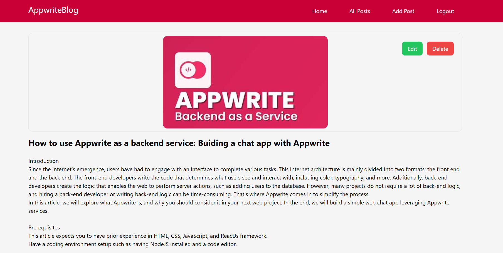
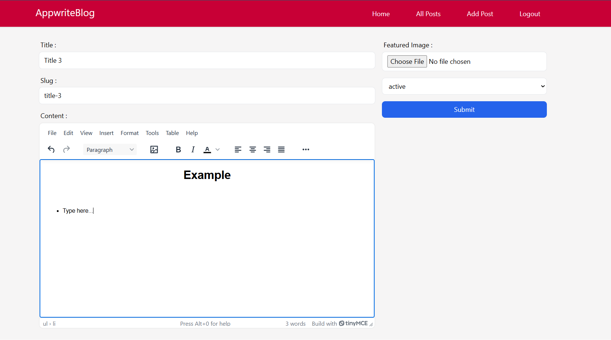
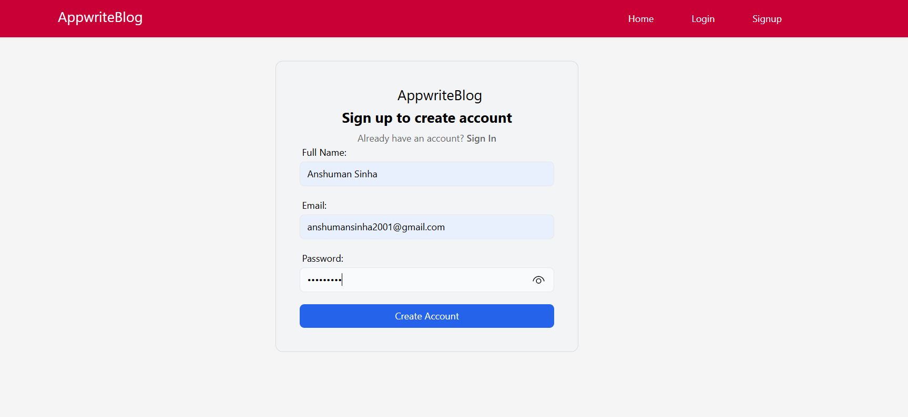
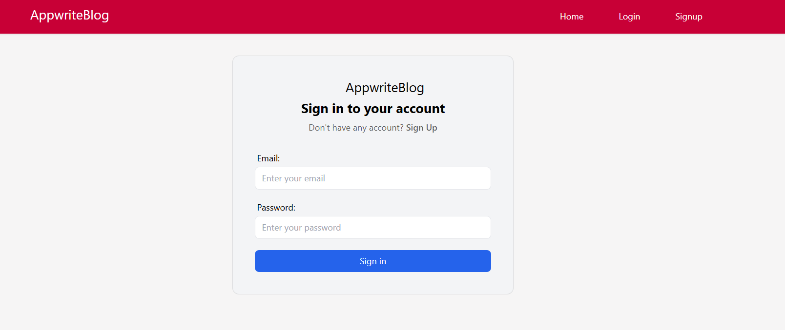

# Blog Website

This is a blog website where users can log in, create, edit, and delete their blogs. Users can also view blogs created by others. The project leverages several modern technologies to provide a seamless and efficient user experience.

<div style="display: flex; justify-content: center;">
    
    
</div>

<div style="display: flex; justify-content: center; margin-top: 20px;">
    
    
</div>

## Technologies

- **Appwrite**: Used as Backend as a Service (BaaS).
- **@reduxjs/toolkit & react-redux**: For state management and store.
- **react-router-dom**: For routes management.
- **@tinymce/tinymce-react**: Provides a Real-Time Editor (RTE) for text formatting (bold, italic, etc.).
- **html-react-parser**: For parsing HTML tags on the website.
- **react-hook-form**: For handling form validation and submission.

## Features

- **Forwarding Refs**: For taking reference of a component in child components.

## Installation

1. Clone the repository:

   ```sh
   git clone https://github.com/anshumansinha2001/appwriteblog.git
   cd appwriteblog
   ```

2. Install the dependencies:

   ```sh
   npm install
   ```

3. Set up environment variables:
   Create a `.env.local` file in the root of the project and add the necessary environment variables as specified in `.env.example`.

4. Start the development server:
   ```sh
   npm start
   ```

## Usage

- **Login**: Users can log in using their credentials.
- **Create Blog**: Authenticated users can create a new blog using the RTE.
- **Edit Blog**: Users can edit their existing blogs.
- **Delete Blog**: Users can delete their blogs.
- **View Blogs**: Users can view blogs created by others.

## Contributing

1. Fork the repository.
2. Create a new branch:
   ```sh
   git checkout -b feature/your-feature-name
   ```
3. Make your changes and commit them:
   ```sh
   git commit -m 'Add some feature'
   ```
4. Push to the branch:
   ```sh
   git push origin feature/your-feature-name
   ```
5. Create a new Pull Request.

## License

This project is licensed under the MIT License - see the [LICENSE](LICENSE) file for details.

## Contact

For any questions or feedback, please reach out to [anshumansinha2001@gmail.com](mailto:anshumansinha2001@gmail.com).
